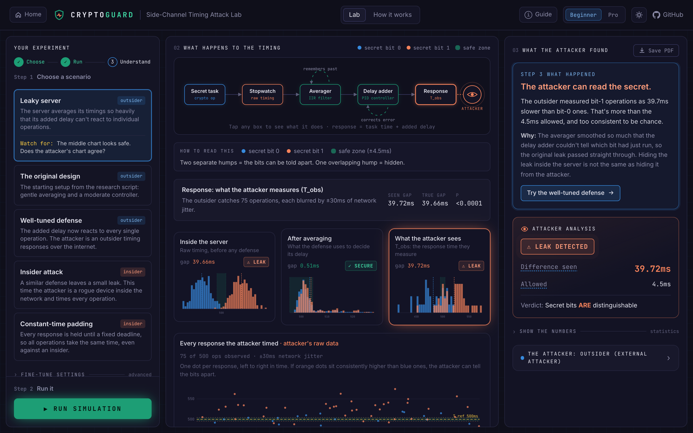
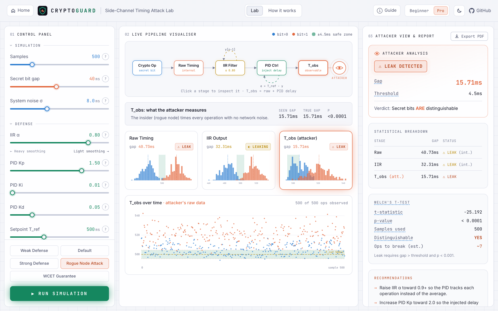
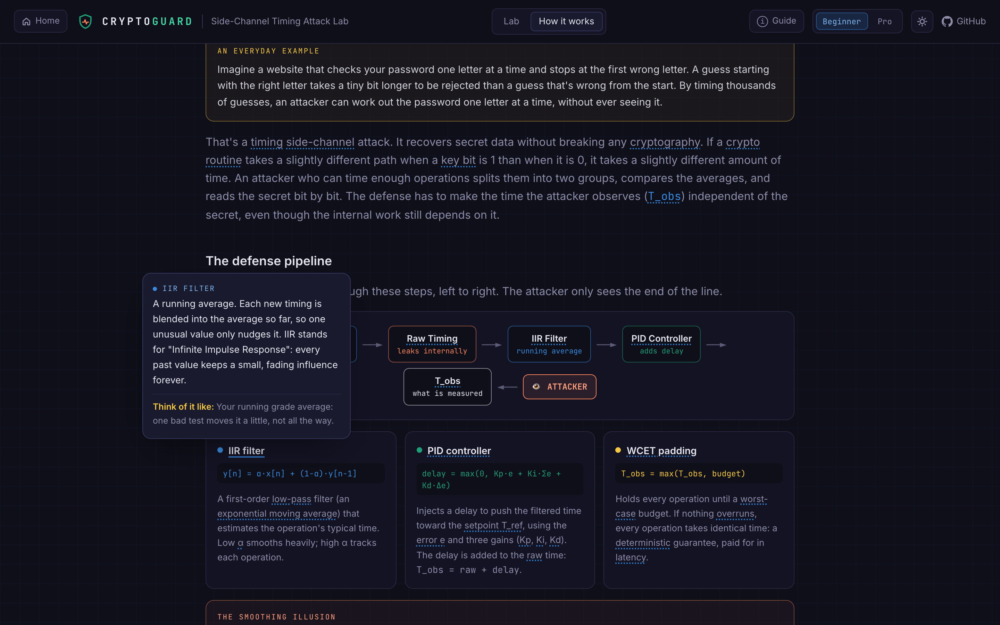
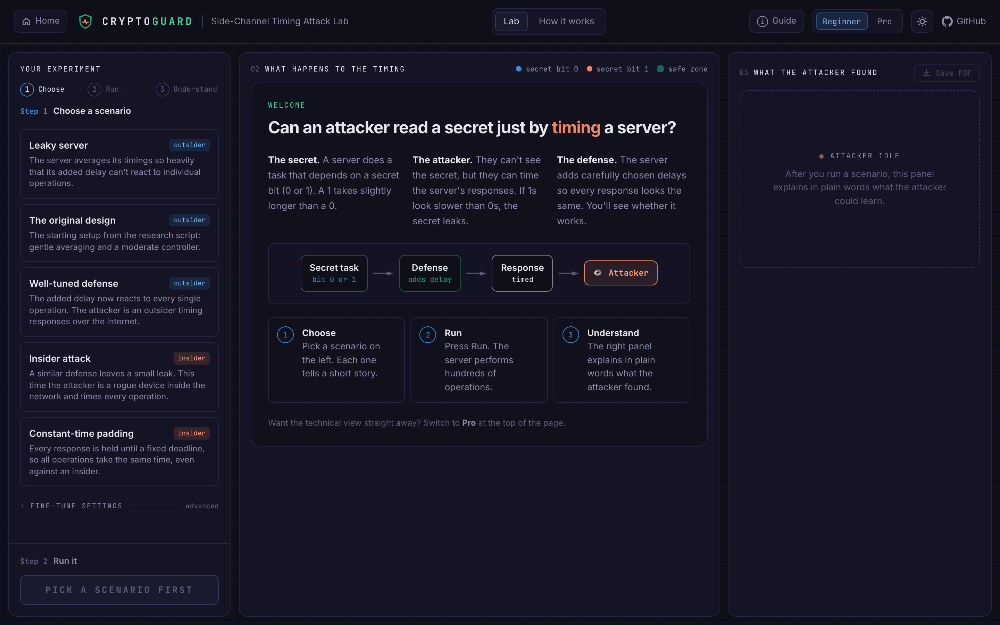
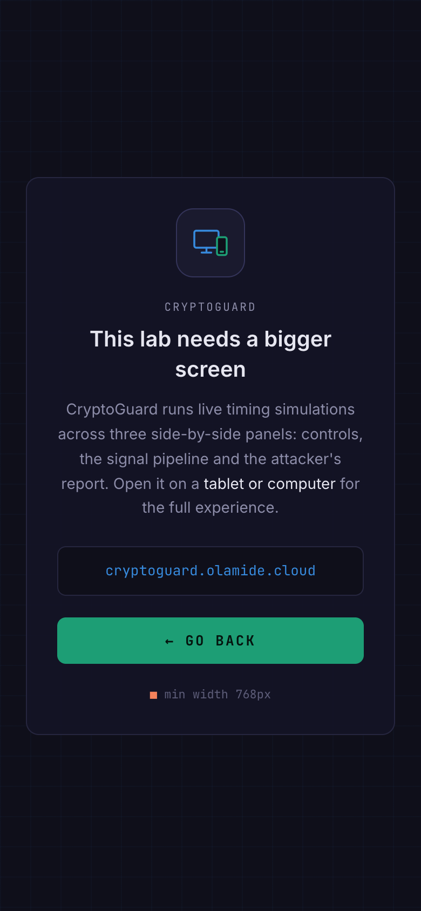

# CryptoGuard

**An interactive lab for side-channel timing attacks.** Watch a secret leak through *how long* a server takes to answer, then see whether an IIR + PID defense pipeline, or constant-time padding, can stop an attacker from reading it.

**Live:** [cryptoguard.olamide.cloud](https://cryptoguard.olamide.cloud) · **Author:** [Olamide Oladokun](https://olamide.cloud)




---

## What it is

A server does a task that depends on a secret bit (0 or 1), and a 1 takes slightly longer than a 0. An attacker can't see the secret, but they can **time the responses**. If the 1s look slower than the 0s, the secret leaks.

The server defends itself with a pipeline:

```
Crypto Op → Raw Timing → [IIR Filter] → [PID Controller] → (WCET pad) → T_obs ← ATTACKER
```

CryptoGuard simulates hundreds of these operations, runs the attacker's statistics on what they could observe, and shows at every stage whether the secret is still readable.

## Features

- **Beginner and Pro modes.** Beginner (the default) is a guided *choose → run → understand* journey:
  - plain-language scenario cards;
  - a plain explanation beside every setting;
  - a "What happened" summary with a suggested next experiment.

  Pro is the full technical dashboard.
- **Live pipeline visualiser.** An animated, clickable pipeline diagram, per-stage histograms with the safe zone shaded, and the attacker's raw samples over time.
- **Attacker report.**
  - A leak / defense-holding verdict;
  - a per-stage gap table;
  - Welch's t-test results;
  - an estimate of the operations needed to break the defense;
  - recommendations generated from the run's own numbers.
- **Two threat models.** An *external attacker* sees 15% of operations through ~30ms of network jitter. A *rogue node* inside the network (a MANET) sees every operation with no jitter.
- **Plain-English glossary.** Every dotted-underlined term (IIR, PID, WCET, p-value, …) explains itself, with an everyday analogy. It works on hover, tap or keyboard focus. The How it works page ends with the full 40-term glossary.
- **PDF export.** A report of the run: configuration, stage table, t-test, findings and charts.
- **Light and dark themes** (dark by default), a **Guide** dialog for both modes, and your **session is saved** in the browser. A simulation never starts by itself.
- **Phone notice.** The lab needs a tablet or computer (≥768px). Phones get a friendly screen with a way back.

## Screenshots

| Pro mode, light theme | Glossary hover card |
|---|---|
|  |  |

| First visit (Beginner welcome) | Phone notice |
|---|---|
|  |  |

## How the simulation works

The engine ([`backend/app/engine.py`](backend/app/engine.py)) is a parameterised port of the original research script, [`backend/original_leakage_analysis.py`](backend/original_leakage_analysis.py). The pipeline maths is unchanged:

| Stage | Formula |
|---|---|
| Raw timing | bit 0 ~ N(500 − gap/2, σ), bit 1 ~ N(500 + gap/2, σ) |
| IIR filter (running average) | `y[n] = α·x[n] + (1 − α)·y[n−1]` |
| PID controller | `delay = max(0, Kp·e + Ki·Σe + Kd·Δe)`, where `e = T_ref − y` |
| Observed time | `T_obs = raw + delay` |
| WCET padding (optional) | `T_obs = max(T_obs, budget)` |

**The verdict.** The attacker splits their observations by secret bit. They report a **leak** only when the gap between the averages exceeds the threshold (4.5ms by default) **and** Welch's t-test gives p < 0.001. The second condition stops random jitter from producing false alarms.

**The key finding: the smoothing illusion.** Heavy smoothing (low α) makes the IIR output *look* secure, because the gap there drops close to zero. But the filter feeds the controller, not the attacker. Once the filter has averaged away which bit just ran, the PID can't cancel it, so the full gap reaches `T_obs`. The PID only closes the gap with high α and Kp ≈ 2, and even then only statistically. **WCET padding is the only deterministic defense:** with no overruns, the gap is exactly 0, even against a rogue node with unlimited samples.

### Scenarios

Leak rates were measured over 30 random seeds each.

| Scenario (Beginner / Pro name) | α / Kp / Ki / Kd | Attacker | Leak rate |
|---|---|---|---|
| Leaky server / Weak Defense | 0.02 / 0.3 / 0.02 / 0.01 | external | 29/30 |
| The original design / Default | 0.05 / 0.8 / 0.1 / 0.05 | external | 27/30 |
| Well-tuned defense / Strong Defense | 0.99 / 2.0 / 0.01 / 0.01 | external | 1/30 (rogue node: 5/30) |
| Insider attack / Rogue Node Attack | 0.8 / 1.5 / 0.01 / 0.05 | rogue node | 30/30 (same settings, external: 4/30) |
| Constant-time padding / WCET Guarantee | Strong + 600ms WCET | rogue node | 0/30 |

## Tech stack

| Layer | Tech |
|---|---|
| Frontend | React 19, TypeScript, Tailwind CSS 4, Vite; hand-drawn SVG charts (no chart library) |
| Backend | FastAPI, NumPy, SciPy; ReportLab + Matplotlib for the PDF |
| Serving | Nginx (static files + rate-limited `/api` proxy) |
| Deployment | Docker Compose behind Traefik (TLS via Let's Encrypt) |

## Project structure

```
CryptoGuard/
├── backend/
│   ├── app/
│   │   ├── engine.py          # simulation, threat models, statistics, recommendations
│   │   ├── main.py            # FastAPI app: /api/simulate, /api/report, /api/health
│   │   └── report.py          # PDF report
│   ├── tests/test_api.py
│   ├── original_leakage_analysis.py   # the original research script
│   └── Dockerfile
├── frontend/
│   ├── src/
│   │   ├── App.tsx            # layout, header, run/session state
│   │   ├── components/        # ControlPanel, PipelinePanel, AttackerPanel, Charts, About, Term, GuideDialog, …
│   │   └── lib/               # scenarios & copy, glossary, theme, session storage
│   ├── nginx.conf             # production server + rate limits
│   └── Dockerfile
├── docs/screenshots/
├── docker-compose.yml         # production (Traefik labels)
├── docker-compose.local.yml   # local Docker run on :8080
├── .env.example               # Traefik settings for deployment
└── DEPLOY.md                  # step-by-step VPS deployment
```

## Getting started

### Prerequisites

- **Python 3.12+**
- **Node.js 22+** (with npm)
- Git

### 1. Clone

```bash
git clone https://github.com/0la-mide/cryptoguard.git
cd cryptoguard
```

### 2. Backend (terminal 1)

macOS / Linux:

```bash
cd backend
python3 -m venv .venv
source .venv/bin/activate
pip install -r requirements-dev.txt
uvicorn app.main:app --reload --port 8000
```

Windows (PowerShell):

```powershell
cd backend
py -m venv .venv
.venv\Scripts\Activate.ps1
pip install -r requirements-dev.txt
uvicorn app.main:app --reload --port 8000
```

The API is now on `http://localhost:8000`, with interactive docs at `http://localhost:8000/api/docs`.

### 3. Frontend (terminal 2)

```bash
cd frontend
npm install
npm run dev
```

Open **http://localhost:5173**. The dev server proxies `/api` to the backend on port 8000.

### Tests and checks

```bash
cd backend && pytest -q                     # API and engine tests
cd frontend && npm run lint && npm run build  # lint, type-check and production build
```

### Run the production containers locally (optional)

This needs Docker. The override publishes the web container only on local port 8080:

```bash
docker compose -f docker-compose.yml -f docker-compose.local.yml up --build
```

Then open **http://localhost:8080**.

## API

| Method | Endpoint | Description |
|---|---|---|
| `POST` | `/api/simulate` | Run a simulation and return the stage statistics, histograms, the attacker's samples, the verdict and recommendations |
| `POST` | `/api/report` | Run the same simulation and return a PDF report. Pass the `seed` from `/simulate` to reproduce a run exactly |
| `GET` | `/api/health` | Health check |

Every field is optional and falls back to its default. Values outside the allowed range return `422`.

```bash
curl -X POST http://localhost:8000/api/simulate \
  -H 'Content-Type: application/json' \
  -d '{"samples": 500, "bit_gap_ms": 40, "alpha": 0.99, "kp": 2.0, "ki": 0.01, "kd": 0.01,
       "threat_model": "rogue_node", "wcet_enabled": true, "seed": 42}'
```

| Field | Range | Default | Meaning |
|---|---|---|---|
| `samples` | 100 – 2000 | 500 | Operations simulated |
| `bit_gap_ms` | 5 – 80 | 40 | How much slower bit 1 is than bit 0 (the raw leak) |
| `noise_std_ms` | 1 – 20 | 8 | System timing noise σ |
| `alpha` | 0.01 – 0.99 | 0.05 | IIR smoothing factor |
| `kp` / `ki` / `kd` | 0.1–2.0 / 0.01–0.5 / 0.01–0.2 | 0.8 / 0.1 / 0.05 | PID gains |
| `setpoint_ms` | 400 – 700 | 500 | PID target T_ref |
| `threat_model` | `external` \| `rogue_node` | `external` | Who is attacking |
| `threshold_ms` | 0 – 50 | 4.5 | Largest gap counted as safe |
| `wcet_enabled`, `wcet_budget_ms` | bool, 500 – 900 | false, 600 | Constant-time padding |
| `seed` | 0 – 2³¹−1 | random | For reproducible runs |

## Deployment

CryptoGuard runs as two containers: `api` (FastAPI) on a private network, and `web` (Nginx), which serves the built frontend and proxies `/api` with per-IP rate limits. An existing **Traefik** instance routes the domain to `web` using Docker labels and issues the TLS certificate.

```bash
cp .env.example .env        # set your Traefik network, entrypoint and cert resolver
docker compose up -d --build
```

Full step-by-step instructions, including how to read your Traefik settings and troubleshoot, are in **[DEPLOY.md](DEPLOY.md)**.

## Author

Built by **Olamide Oladokun**: [olamide.cloud](https://olamide.cloud) · [GitHub @0la-mide](https://github.com/0la-mide)

See also: [MalwareCNN](https://malwarecnn.olamide.cloud), AI-powered malware family classification.
